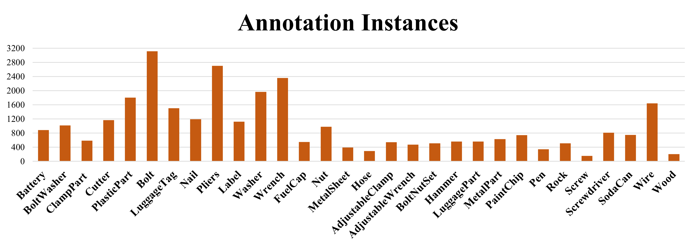

# <a name="overview"/>Foreign Object Debris Dataset Overview
The FOD-A dataset consists of several thousand images of common FOD objects and types of material with a typical runway or taxiway background. While the main annotation is bounding boxes, FOD-A also includes light categorization annotations and weather categorization annotations. FOD-A is designed to be easily expanded using a command-line tool developed alongside the dataset. The instructions for this process are contained in a pdf file included in this repository.

* [Download](#download_instructions)

# <a name="download_instructions"/>Download
### Most Current Version Download

### Previous FOD-A Version Download

[FOD-A Version 2.0 original format (9.1 gb) 400x400 image size](https://docs.google.com/uc?export=download&id=1AMLDjMlobDU5etls3bmWzBeEk_NTyK0C).  
[FOD-A Version 2.0 Pascal VOC format (434 mb) 300x300 image size](https://docs.google.com/uc?export=download&id=1q4yEcEEUuRk9kdEMOra-ZEFn6TJ8gB7h).  

[FOD-A Version 1.0 Pascal VOC format (150 mb) 300x300 image size](https://docs.google.com/uc?export=download&id=1x6kc8gLNE-2dAKODBIVSQEAoXw8RmTSk).  
[FOD-A Version 1.0 original format (3.8 gb) - 400x400 image size](https://docs.google.com/uc?export=download&id=1wkw1sINcNPRGzXg_vw212Hsi4INB7UrN).  
