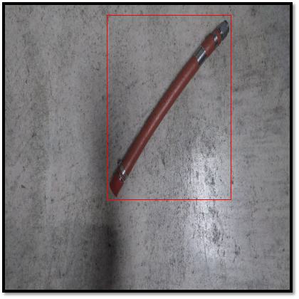
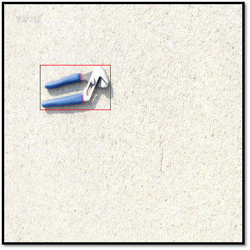
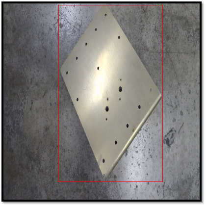

# FOD-data
A dataset of foreign object debris (FOD) designed for computer vision applications.

* [Dataset Overview](#overview)
  * [Sample Images](#sample_images)
* [Dataset Specifications](#specifications)
  * [Dataset Counts](#dataset_counts)
  * [File Format](#file_format)
  * [Expansion Directions](#expansion_directions)
* [Download Instructions](#download_instructions)
* [Coming Soon](#coming_soon)

# <a name="overview"/>Foreign Object Debris Dataset Overview
This foreign object debris (FOD) dataset is an image dataset with bounding box annotations.

## <a name="sample_images"/>Samples Images with Bounding Boxes

<table>
  <tr>
  <td>Hose</td>
  <td>Pliers</td>
  <td>Metal Sheet</td>
 </tr>
 <tr>
  <td></td>
  <td></td>
  <td></td>
 </tr>
</table>

Please note that the borders are not included in the original images, but provided to clarify picture boundries.

# <a name="specifications"/>Dataset Specifications
The FOD dataset consists of thousands of images (currently 12,971 images) of common FOD objects and types of material with a typical runway or taxiway background. All images are stored with a resolution of 400x400 pixels. Soon, however, we will release our resizing tool tailored to this dataset to another github repository. This tool can resize the images and annotations of this dataset to any required resolution. During initial dataset preperation, images were stripped, frame by frame, from videos taken of object using our expansion tool. These videos were recorded in a local airport to ensure accuracy. Once the frames from these videos were stored indivudally as '.png' files, the videos were manually annotated using an open-source tool aptly named Computer Vision Annotation Tool (CVAT).

## <a name="dataset_counts"/>Dataset Counts
| Object | Instances |
|--------|-------|
| Bolt  | 3118  |
| Nut | 520 |
| MetalSheet | 394 |
| AdjustableClamp | 544 |
| Washer | 1797 |
| LuggageTag | 1616 |
| Plier | 2099 |
| Nail | 1005 |
| Hose | 294 |
| BoltNutSet | 514 |
| Wrench | 2359 |
| Total | 14260 |

## <a name="file_format"/>File Format
Each individual folder is a seperate annotated video. Within each of these folders, there is a folder of '.PNG' images labeled numberically from zero until the final frame and a separate folder containing the .XML which is also sequentially numbered from 0. At this time, we require the annotation file names to match the '.PNG' filenames. For example, frame_000440.PNG correlates to frame_000440.XML.

## <a name="expansion_directions"/>Expansion Directions
This dataset is designed to be easily expanded (as needed) using a command-line tool developed specifically for this dataset. This tool and step-by-step directions will be released soon, alongside a detailed paper explaining this dataset and future theories for it's use. Instructions will be clearly explained in this section, and the open-source expansion tool will be located in a seperate github repository.

# <a name="download_instructions"/>Download Instructions
This dataset is too large to be stored directly on github. The dataset is about ~3.8 gigabytes, so google will give you a warning when attempting to install the '.zip file'. Therefore, the dataset is stored on google drive, and can be downloaded [here](https://docs.google.com/uc?export=download&id=1wkw1sINcNPRGzXg_vw212Hsi4INB7UrN).

# <a name="coming_soon"/>Coming Soon
- expansion directions
- dataset resizing tool
- dataset expansion tool
