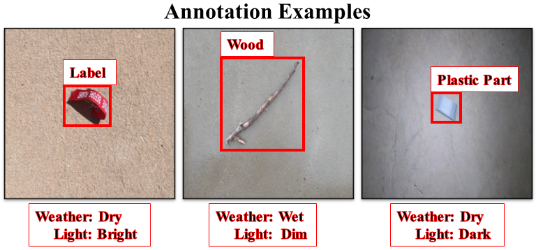

# <a name="overview"/>Foreign Object Debris in Airports (FOD-A) Dataset Overview
The FOD-A dataset consists of images of common Foreign Object Debris (FOD) with a runway or taxiway background. While the main annotation style consists of bounding boxes, FOD-A also includes seperate light-level and weather categorization annotations. FOD-A is designed to be easily expanded using a command-line tool developed alongside the dataset. The instructions for this process are contained in a pdf file included in this repository.

  

  

  

  

# <a name="download_instructions"/>Download
### Most Current Version Download
[FOD-A Version 2.1 original format (8.3 gb) 400x400 image size](https://docs.google.com/uc?export=download&id=1qUpUu4fc90TrsWHLM0pCfIaFvHoNj8Ql).  
[FOD-A Version 2.1 Pascal VOC format (412 mb) 300x300 image size](https://docs.google.com/uc?export=download&id=1zryvMCz51g1x9ynuRtJEh7iYF79bBVLz).  

### Previous FOD-A Version Download

[FOD-A Version 2.0 original format (9.1 gb) 400x400 image size](https://docs.google.com/uc?export=download&id=1AMLDjMlobDU5etls3bmWzBeEk_NTyK0C).  
[FOD-A Version 2.0 Pascal VOC format (434 mb) 300x300 image size](https://docs.google.com/uc?export=download&id=1q4yEcEEUuRk9kdEMOra-ZEFn6TJ8gB7h).  

[FOD-A Version 1.0 original format (3.8 gb) - 400x400 image size](https://docs.google.com/uc?export=download&id=1wkw1sINcNPRGzXg_vw212Hsi4INB7UrN).  
[FOD-A Version 1.0 Pascal VOC format (146 mb) 300x300 image size](https://docs.google.com/uc?export=download&id=1x6kc8gLNE-2dAKODBIVSQEAoXw8RmTSk).  

# <a name="citation"/>Citation
If you find this dataset beneficial to your work, please cite the paper: 

Travis Munyer, Daniel Brinkman, Chenyu Huang, and Xin Zhong. 2021. Integrative Use of Computer Vision and Unmanned Aircraft Technologies in Public Inspection: Foreign Object Debris Image Collection. DG.O2021: The 22nd Annual International Conference on Digital Government Research. Association for Computing Machinery, New York, NY, USA, 437–443. DOI:https://doi.org/10.1145/3463677.3463743

Bibtex format: 

@inbook{10.1145/3463677.3463743,
author = {Munyer, Travis and Brinkman, Daniel and Huang, Chenyu and Zhong, Xin},
title = {Integrative Use of Computer Vision and Unmanned Aircraft Technologies in Public Inspection: Foreign Object Debris Image Collection},
year = {2021},
isbn = {9781450384926},
publisher = {Association for Computing Machinery},
address = {New York, NY, USA},
url = {https://doi.org/10.1145/3463677.3463743},
booktitle = {DG.O2021: The 22nd Annual International Conference on Digital Government Research},
pages = {437–443},
numpages = {7}
}
